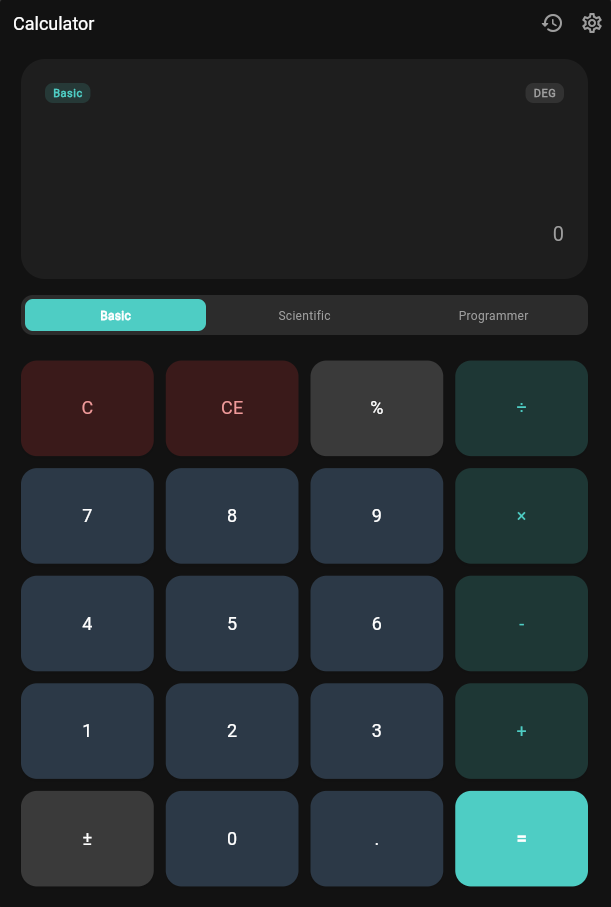
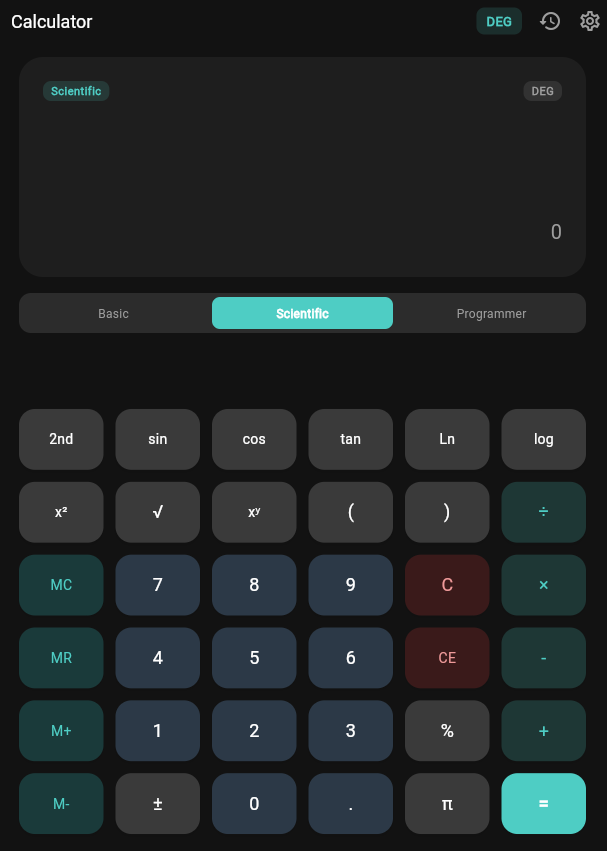
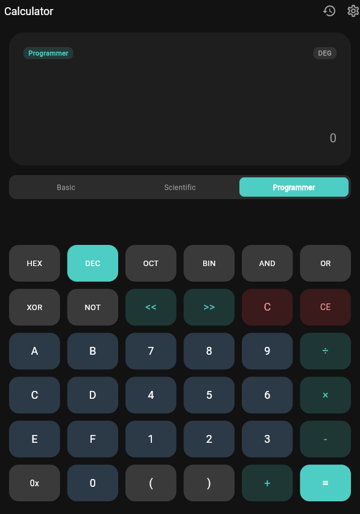
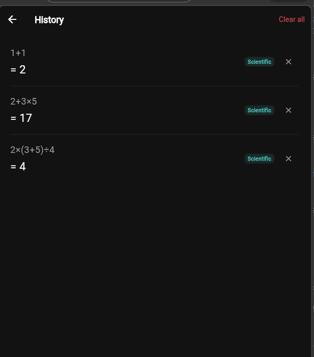
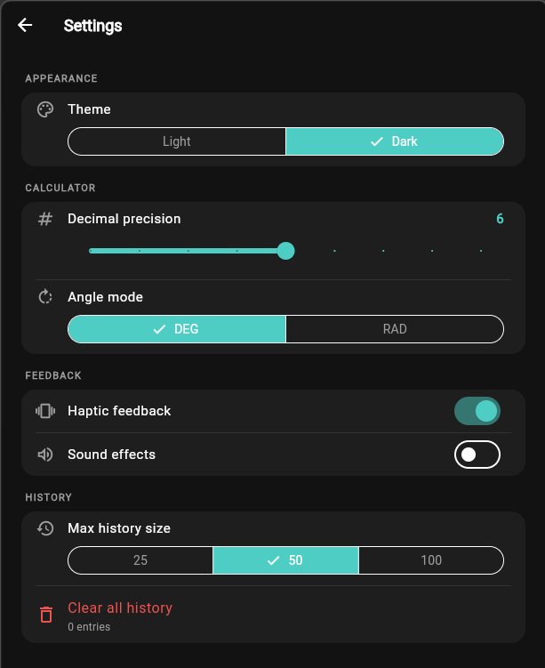

# Advanced Calculator - Máy Tính Nâng Cao

<div align="center">


**Ứng dụng máy tính di động toàn năng với giao diện hiện đại và các tính năng nâng cao**

</div>

---

## Mục Lục

- [Mô Tả Dự Án](#-mô-tả-dự-án)
- [Các Tính Năng](#-các-tính-năng)
- [Ảnh Chụp Ứng Dụng](#-ảnh-chụp-ứng-dụng)
- [Kiến Trúc Ứng Dụng](#-kiến-trúc-ứng-dụng)
- [Hướng Dẫn Cài Đặt](#-hướng-dẫn-cài-đặt)
- [Hướng Dẫn Kiểm Tra](#-hướng-dẫn-kiểm-tra)
- [Giới Hạn Đã Biết](#-giới-hạn-đã-biết)
- [Cải Tiến Trong Tương Lai](#-cải-tiến-trong-tương-lai)

---

## Mô Tả Dự Án

**Advanced Calculator** là một ứng dụng máy tính di động được phát triển bằng Flutter, cung cấp ba chế độ tính toán khác nhau để đáp ứng nhu cầu của mọi người dùng - từ những phép tính cơ bản đến những phép tính khoa học và lập trình phức tạp.

Ứng dụng được thiết kế với:
- Giao diện người dùng hiện đại và trực quan
- Hỗ trợ chế độ sáng/tối
- Lưu trữ lịch sử tính toán
- Các cài đặt có thể tùy chỉnh
- Xử lý lỗi vững chắc

---

## Các Tính Năng

### 1. Chế Độ Cơ Bản (Basic Mode)
Dành cho những phép tính hàng ngày:
- Cộng, trừ, nhân, chia
- Đảo dấu số
- Tính phần trăm
- Bộ nhớ tạm (M+, M-, MR, MC)

### 2. Chế Độ Khoa Học (Scientific Mode)
Cho các phép tính toán học nâng cao:
- Các hàm lượng giác: sin, cos, tan, asin, acos, atan
- Logarit: ln (natural log), log₁₀, log₂
- Hàm mũ: x², x³, xʸ, e^x
- Giai thừa (n!)
- Hằng số π và e
- Chuyển đổi giữa độ (DEG) và radian (RAD)

### 3. Chế Độ Lập Trình (Programmer Mode)
Cho các lập trình viên và những người làm việc với số nhị phân:
- Chuyển đổi giữa các hệ cơ số:
  - Nhị phân (BIN)
  - Bát phân (OCT)
  - Thập phân (DEC)
  - Thập lục phân (HEX)
- Các phép toán bitwise: AND, OR, XOR, NOT

### Tính Năng Chung
- **Lịch Sử Tính Toán**: Lưu và xem lại các phép tính trước
- **Ghi đè Chủ Đề**: Chế độ sáng/tối với tùy chỉnh màu sắc
- **Cài Đặt**: Điều chỉnh kích thước lịch sử, chữ số thập phân
- **Lưu Trữ Vĩnh Viễn**: Dữ liệu được lưu trên thiết bị

---

## Ảnh Chụp Ứng Dụng

> **Ghi chú**: Vui lòng thêm ảnh chụp màn hình cho các tính năng sau:

### Chế Độ Cơ Bản


### Chế Độ Khoa Học


### Chế Độ Lập Trình


### Lịch Sử


### Cài Đặt

---

## Kiến Trúc Ứng Dụng

### Sơ Đồ Tổng Quan

```
┌─────────────────────────────────────────────────────────────┐
│                        UI Layer                             │
│  ┌──────────────┬──────────────┬──────────────────────────┐ │
│  │  Calculator  │   History    │      Settings            │ │
│  │   Screen     │   Screen     │      Screen              │ │
│  └──────────────┴──────────────┴──────────────────────────┘ │
└──────────────────┬──────────────────────────────────────────┘
                   │
┌──────────────────▼──────────────────────────────────────────┐
│                   Provider Layer                            │
│  ┌──────────────┬──────────────┬──────────────────────────┐ │
│  │ Calculator   │   History    │       Theme              │ │
│  │ Provider     │   Provider   │       Provider           │ │
│  └──────────────┴──────────────┴──────────────────────────┘ │
└──────────────────┬──────────────────────────────────────────┘
                   │
┌──────────────────▼──────────────────────────────────────────┐
│                   Logic Layer                               │
│  ┌──────────────┬──────────────────────────────────────┐    │
│  │ Calculator   │      Expression Parser               │    │
│  │ Logic        │      (Math Expression Evaluation)    │    │
│  └──────────────┴──────────────────────────────────────┘    │
└──────────────────┬──────────────────────────────────────────┘
                   │
┌──────────────────▼──────────────────────────────────────────┐
│                   Storage Layer                             │
│  ┌──────────────────────────────────────────────────────┐   │
│  │  SharedPreferences (Persistent Local Storage)        │   │
│  └──────────────────────────────────────────────────────┘   │
└─────────────────────────────────────────────────────────────┘
```

### Cấu Trúc Thư Mục

```
lib/
├── main.dart                          # Điểm vào ứng dụng
│
├── models/
│   ├── calculator_mode.dart          # Các enum: Mode, AngleMode, Base
│   ├── calculation_history.dart      # Model lưu trữ lịch sử
│   └── calculator_settings.dart      # Cài đặt ứng dụng
│
├── providers/                        # State Management (Provider)
│   ├── calculator_provider.dart      # Logic tính toán
│   ├── history_provider.dart         # Quản lý lịch sử
│   └── theme_provider.dart           # Quản lý ghi đè chủ đề
│
├── screens/
│   ├── calculator_screen.dart        # Màn hình chính
│   ├── history_screen.dart           # Màn hình lịch sử
│   └── settings_screen.dart          # Màn hình cài đặt
│
├── widgets/                          # Thành phần UI tái sử dụng
│   ├── calculator_button.dart        # Nút bấm riêng lẻ
│   ├── button_grid.dart              # Lưới nút bấm
│   ├── display_area.dart             # Khu vực hiển thị
│   └── mode_selector.dart            # Chọn chế độ
│
├── services/
│   └── storage_service.dart          # Quản lý lưu trữ dữ liệu
│
└── utils/
    ├── calculator_logic.dart         # Logic tính toán thuần (không UI)
    ├── expression_parser.dart        # Phân tích biểu thức toán học
    └── constants.dart                # Hằng số ứng dụng
```

### Luồng Dữ Liệu

```
User Input (Nút bấm)
    ↓
Calculator Provider
    ↓
Calculator Logic / Expression Parser
    ↓
Display Result
    ↓
Save to History Provider
    ↓
StorageService (Persist to SharedPreferences)
```

---

## Hướng Dẫn Cài Đặt

### Yêu Cầu Hệ Thống
- **Flutter SDK**: >= 3.11.4
- **Dart SDK**: >= 3.11.4
- **Android Studio / Xcode**: Để biên dịch cho nền tảng tương ứng
- **Git**: Để clone repository

### Các Bước Cài Đặt

#### 1. Clone Repository
```bash
git clone <repository-url>
cd advanced_caculator
```

#### 2. Lấy Dependencies
```bash
flutter pub get
```

#### 3. Kiểm Tra Thiết Lập
```bash
flutter doctor
```

Đảm bảo không có lỗi quan trọng. Nếu có, hãy tuân theo hướng dẫn của Flutter.

#### 4. Chạy Ứng Dụng

**Trên Emulator/Simulator:**
```bash
flutter run
```

**Trên Thiết Bị Thực:**
1. Kết nối thiết bị USB
2. Bật USB Debugging
3. Chạy:
```bash
flutter run
```

**Chế Độ Release (Tối ưu hóa):**
```bash
flutter run --release
```

#### 5. Build APK/App Bundle (Tùy Chọn)

**APK (Android):**
```bash
flutter build apk
```

**iOS:**
```bash
flutter build ios
```

**Web:**
```bash
flutter build web
```

---

## Hướng Dẫn Kiểm Tra

### Chạy Tất Cả Unit Tests

```bash
flutter test
```

### Chạy Test Cụ Thể

```bash
# Kiểm tra logic tính toán
flutter test test/unit_test.dart

# Kiểm tra widget
flutter test test/widget_test.dart
```

### Kiểm Tra Bảo Phủ Code

```bash
flutter test --coverage
```

Kết quả sẽ được lưu trong thư mục `coverage/`.

### Các Test Cases Chính

| Test Case | Mô Tả |
|-----------|-------|
| **Phép Tính Cơ Bản** | Cộng, trừ, nhân, chia với kết quả đúng |
| **Xử Lý Lỗi** | Chia cho 0, logarit số âm, asin/acos ngoài phạm vi |
| **Chuyển Đổi Hệ Cơ Số** | Nhị phân ↔ Thập phân ↔ Thập lục phân |
| **Lịch Sử** | Lưu/xoá/giới hạn số mục lịch sử |
| **Lưu Trữ** | Cài đặt được lưu và khôi phục đúng |
| **Giao Diện** | Widget render đúng với các input khác nhau |

### Ví Dụ Kiểm Tra

```dart
void main() {
  test('Cộng hai số dương', () {
    expect(CalculatorLogic.add(5, 3), 8);
  });

  test('Chia cho 0 ném lỗi', () {
    expect(
      () => CalculatorLogic.divide(10, 0),
      throwsA(isA<CalculatorException>()),
    );
  });
}
```

---

## Giới Hạn Đã Biết

1. **Độ Chính Xác Số Thực**
   - Máy tính sử dụng số thực 64-bit (double), nên có thể có sai số làm tròn
   - Ví dụ: 0.1 + 0.2 = 0.30000000000000004 (vấn đề phổ biến của floating-point)

2. **Giới Hạn Lịch Sử**
   - Kích thước lịch sử mặc định: 100 mục
   - Có thể được thay đổi trong cài đặt, nhưng quá lớn có thể ảnh hưởng đến hiệu suất

3. **Hỗ Trợ Nền Tảng**
   - Ứng dụng hiện được tối ưu hóa cho Android và iOS
   - Hỗ trợ web còn hạn chế

4. **Phụ Thuộc Mạng**
   - Ứng dụng không yêu cầu kết nối mạng
   - Tất cả dữ liệu được lưu cục bộ

5. **Giới Hạn Biểu Thức**
   - Độ dài tối đa của biểu thức: không có giới hạn cụ thể nhưng phụ thuộc vào bộ nhớ thiết bị
   - Không hỗ trợ các hàm tùy chỉnh

6. **Phép Tính Lập Trình**
   - Hỗ trợ các số nguyên 64-bit
   - Các phép toán bitwise hoạt động trên số nguyên

---

## Cải Tiến Trong Tương Lai

- [ ] **Hỗ trợ nhiều ngôn ngữ** (i18n)
  - Tiếng Anh, Tiếng Việt, Tiếng Trung, v.v.
  
- [ ] **Tính năng chia sẻ kết quả**
  - Chia sẻ phép tính qua SMS, Email, Social Media

- [ ] **Chế độ bảng tính nhỏ**
  - Bảng tính đơn giản với công thức cơ bản

- [ ] **Cải tiến UI/UX**
  - Thêm animation mượt mà
  - Thiết kế responsive tốt hơn
  - Hỗ trợ tablet landscape mode

- [ ] **Hỗ trợ đơn vị**
  - Chuyển đổi đơn vị (độ dài, khối lượng, nhiệt độ, v.v.)

- [ ] **Lịch sử chi tiết**
  - Tìm kiếm lịch sử
  - Lọc theo ngày/thời gian
  - Export lịch sử thành CSV

- [ ] **API Công Khai**
  - Cho phép các ứng dụng khác sử dụng engine tính toán

---

## Dependencies

| Package | Phiên Bản | Mục Đích |
|---------|----------|---------|
| **provider** | ^6.1.5 | State Management |
| **shared_preferences** | ^2.5.5 | Lưu trữ cục bộ |
| **math_expressions** | ^3.1.0 | Phân tích biểu thức toán |
| **intl** | ^0.20.2 | Quốc tế hóa & định dạng |
| **flutter_lints** | ^6.0.0 | Lint rules |
| **mockito** | ^5.6.4 | Unit testing |

---

**Advanced Calculator** được phát triển như một phần của khóa học Phát Triển Ứng Dụng Di Động Đa Nền Tảng.


<div align="center">

</div>
